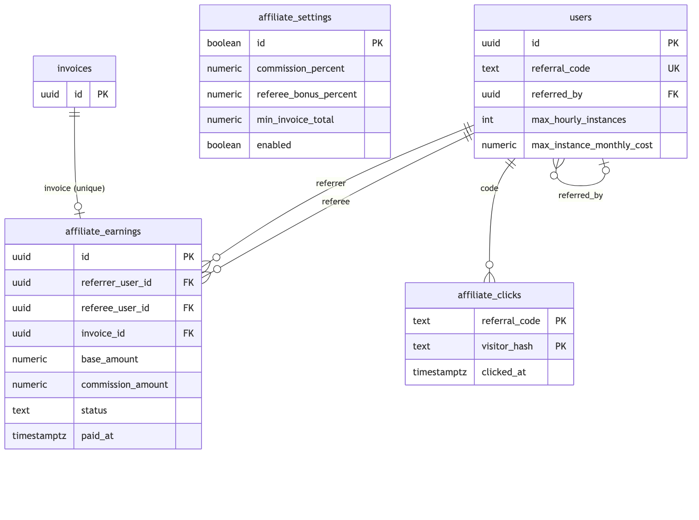
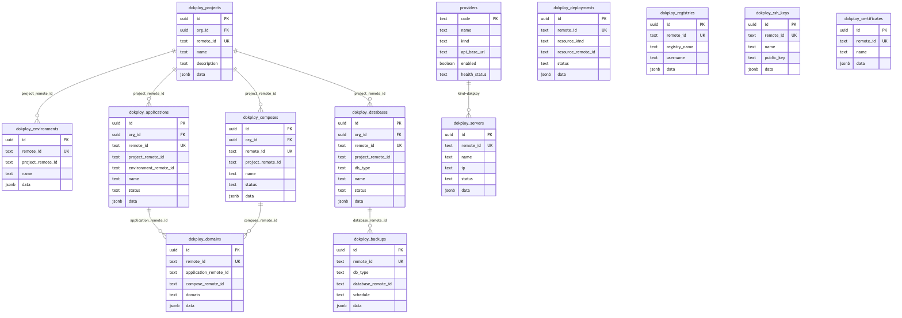
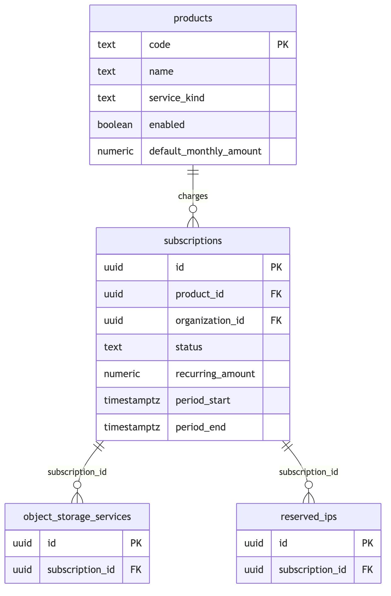
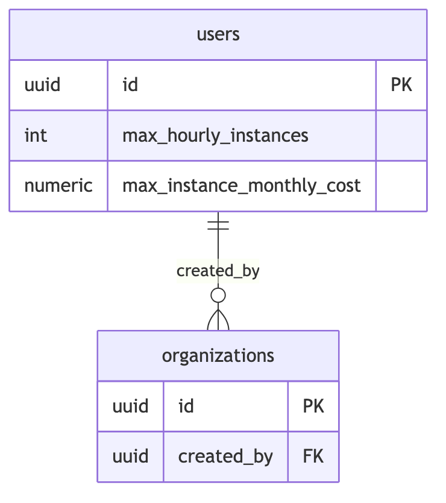
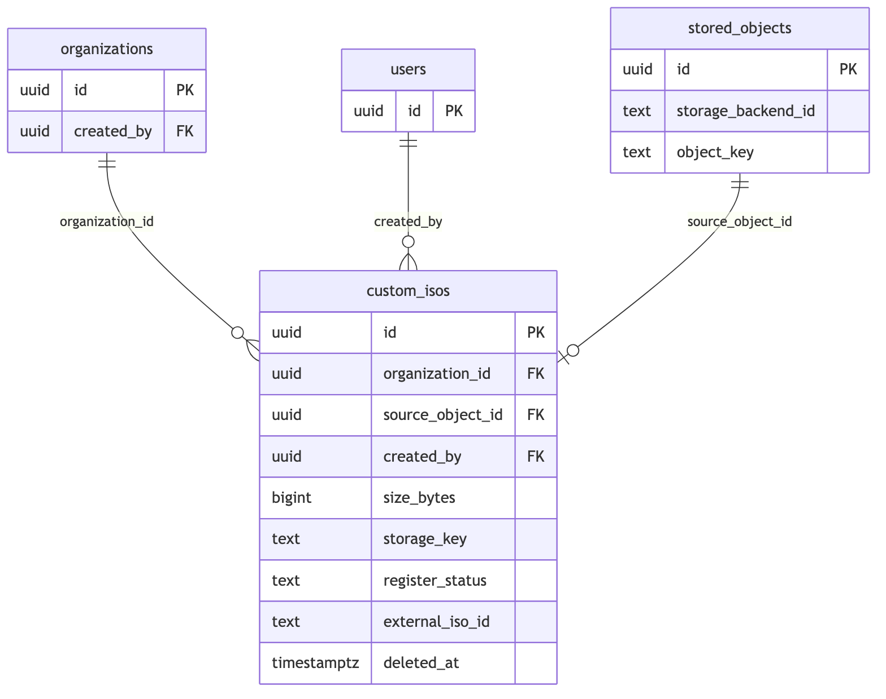

# ERD — Fitur Baru Kilat Cloud

Entity Relationship Diagram untuk domain yang ditambahkan setelah skema inti:
dokploy (PaaS mirror), affiliate/referral, paid products, resource limits, dan ISO quotas.
Semua tabel berada di schema `app`.

> File sumber diagram: `docs/erd/*.mmd` (render ulang via `npx mmdc -i docs/erd/<name>.mmd`).

## 1. Affiliate / Referral

- Referral code dibuat sekali per user (`POST /me/affiliate/code`), disimpan di `users.referral_code`.
- Komisi dihitung saat invoice **settled** (bukan dibuat) — `affiliate_earnings.invoice_id UNIQUE` menjamin idempotent.
- Dashboard affiliate (`GET /me/affiliate`): total_referrals, total_unique_visitors, current_earnings, total_earned, available_balance.

## 2. Dokploy PaaS (Mirror + Universal Proxy)

- Semua `remote_id` UNIQUE per tabel → upsert sinkronisasi idempotent.
- `data jsonb` menyimpan payload upstream mentah; kolom bernama hanya untuk listing/join.
- Akses: `SYNC /v1/admin/dokploy/sync` + `GET /v1/admin/dokploy/db/:entity` (mirror), `v1.All("/dokploy/*")` proxy verbatim ke `<api_base_url>/api/<tag.method>`.
- Provider `dokploy` di-seed disabled; admin isi `api_base_url` + API key via `POST /v1/admin/providers`. Relasi `providers → dokploy_servers` bersifat logis (kind='dokploy').

## 3. Paid Products (Object Storage, Reserved IP)

- Seed: `kilat-object-storage` (langganan bulanan), `kilat-reserved-ip`.
- Harga disalin ke `subscriptions.recurring_amount` saat attach → perubahan admin hanya berlaku untuk subscription baru.

## 4. Resource Limits (Onidel hourly instances)

- Berlaku HANYA untuk on-demand hourly instance.
- Efektif per owner: batas terendah antara user dan team owner (via `organizations.created_by`).
- Enforcement: `internal/compute/resource_limits.go`.

## 5. ISO Quotas (Onidel)

- Batas: max **15 GiB** per ISO, max **10** ISO per user, total **50 GiB** per user (lewat `organizations.created_by`).
- Hapus soft → `register_status='removed'` → kuota dibebaskan.

## Ringkasan relasi lintas domain

| Sumber | Target | Kunci |
|---|---|---|
| `users.referral_code` | `affiliate_clicks.referral_code` | klik tracking (no FK) |
| `users.referred_by` | `users.id` | referral tree |
| `affiliate_earnings.referrer_user_id` | `users.id` | referrer |
| `affiliate_earnings.referee_user_id` | `users.id` | referee |
| `affiliate_earnings.invoice_id` | `invoices.id` | idempotent accrual |
| `object_storage_services.subscription_id` | `subscriptions.id` | billing |
| `reserved_ips.subscription_id` | `subscriptions.id` | billing |
| `custom_isos.source_object_id` | `stored_objects.id` | upload content |
| `custom_isos.created_by` | `users.id` | quota attribution |
| `custom_isos.organization_id` | `organizations.id` | ownership |

> Catatan: relasi `dokploy_*` antar mirror memakai `remote_id` (text) + index, BUKAN FK PostgreSQL — sinkronisasi milik aplikasi.
