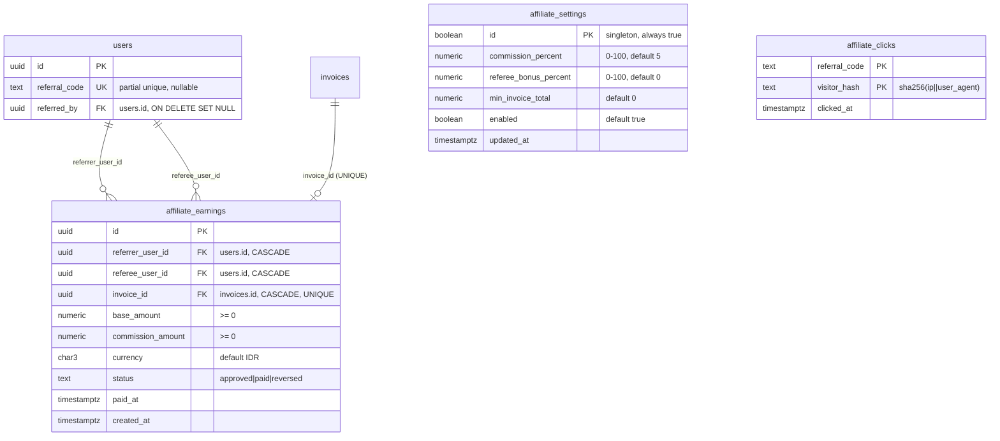
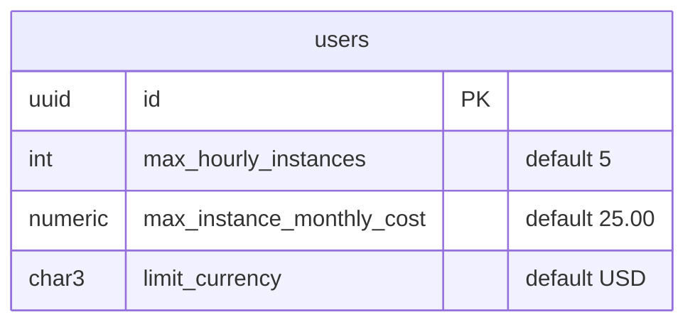

# ERD — Fitur Baru Kilat Cloud

Entity Relationship Diagram untuk domain yang ditambahkan setelah skema inti:
dokploy (PaaS mirror), affiliate/referral, paid products, resource limits, dan ISO quotas.
Semua tabel berada di schema `app`. Foreign key disertakan sesuai relasi yang didefinisikan migrasi.

## 1. Affiliate / Referral



- Referral code dibuat sekali per user (`POST /me/affiliate/code`), disimpan di `users.referral_code`.
- Komisi dihitung saat invoice **settled** (bukan dibuat) — `affiliate_earnings.invoice_id UNIQUE` menjamin idempotent.
- Dashboard affiliate (`GET /me/affiliate`): total_referrals, total_unique_visitors (count `affiliate_clicks` per code), current_earnings, total_earned, available_balance.

## 2. Dokploy PaaS (Mirror + Universal Proxy)

```mermaid
erDiagram
    providers ||--o{ dokploy_servers : "kind='dokploy'"
    dokploy_projects ||--o{ dokploy_environments : "project_remote_id"
    dokploy_projects ||--o{ dokploy_applications : "project_remote_id"
    dokploy_projects ||--o{ dokploy_composes : "project_remote_id"
    dokploy_projects ||--o{ dokploy_databases : "project_remote_id"
    dokploy_applications ||--o{ dokploy_domains : "application_remote_id"
    dokploy_composes ||--o{ dokploy_domains : "compose_remote_id"
    dokploy_databases ||--o{ dokploy_backups : "database_remote_id"

    providers {
        text code PK "('dokploy' seeded, enabled=false, kind='dokploy')"
        text api_base_url
        text credentials_ciphertext "x-api-key AES-256-GCM"
        boolean enabled
        text health_status
    }
    dokploy_projects {
        uuid id PK
        uuid org_id, remote_id text UK, name, description, data jsonb
    }
    dokploy_environments {
        uuid id PK
        text remote_id UK
        text project_remote_id
        text name, data jsonb
    }
    dokploy_applications {
        uuid id PK
        uuid org_id
        text remote_id UK
        text project_remote_id, environment_remote_id
        text name, status, data jsonb
    }
    dokploy_composes {
        uuid id PK
        uuid org_id, remote_id UK, project_remote_id
        text name, status, data jsonb
    }
    dokploy_databases {
        uuid id PK
        uuid org_id, remote_id UK, project_remote_id
        text db_type "postgres|mysql|mariadb|mongo|redis|libsql"
        text name, status, data jsonb
    }
    dokploy_domains {
        uuid id PK
        text remote_id UK
        text application_remote_id, compose_remote_id
        text domain, data jsonb
    }
    dokploy_deployments {
        uuid id PK
        text remote_id UK
        text resource_kind "application|compose|server"
        text resource_remote_id
        text status, data jsonb
    }
    dokploy_backups {
        uuid id PK
        text remote_id UK
        text db_type, database_remote_id, schedule, data jsonb
    }
    dokploy_servers { uuid id PK, text remote_id UK, name, ip, status, data jsonb }
    dokploy_registries { uuid id PK, text remote_id UK, registry_name, username, data jsonb }
    dokploy_ssh_keys { uuid id PK, text remote_id UK, name, public_key, data jsonb }
    dokploy_certificates { uuid id PK, text remote_id UK, name, data jsonb }
```

- Semua `remote_id` UNIQUE per tabel → upsert sinkronisasi idempotent.
- `data jsonb` menyimpan payload upstream mentah; kolom bernama hanya untuk listing/join.
- Akses: `SYNC /v1/admin/dokploy/sync` + `GET /v1/admin/dokploy/db/:entity` (mirror), `v1.All("/dokploy/*")` proxy verbatim ke `<api_base_url>/api/<tag.method>`.

## 3. Paid Products (Object Storage, Reserved IP)

```mermaid
erDiagram
    products ||--o{ subscriptions : "charges monthly"
    subscriptions ||--o{ object_storage_services : "subscription_id"
    subscriptions ||--o{ reserved_ips : "subscription_id"

    products {
        text code PK
        text name, service_kind "object_storage|other"
        text description, enabled, sort_order
        numeric default_monthly_amount "default 0, override via PATCH /admin/products/:id"
    }
    subscriptions {
        uuid id PK
        uuid product_id FK
        uuid organization_id FK
        text status "active|cancelled|past_due|..."
        numeric recurring_amount "copied at attach, never re-read"
        timestamptz period_start, period_end
    }
    object_storage_services {
        uuid id PK
        uuid subscription_id FK "subscriptions.id, ON DELETE SET NULL"
    }
    reserved_ips {
        uuid id PK
        uuid subscription_id FK "subscriptions.id, ON DELETE SET NULL"
    }
```

- Seed: `kilat-object-storage` (50.000 IDR/bln), `kilat-reserved-ip` (20.000 IDR/bln).
- Harga disalin ke `subscriptions.recurring_amount` saat attach → perubahan admin hanya berlaku untuk subscription baru.

## 4. Resource Limits (Onidel hourly instances)



- Berlaku HANYA untuk on-demand hourly instance (bukan paket bulanan/custom).
- Efektif per owner: batas terendah antara user dan team owner (dari `organizations.created_by`).
- Enforcement: `internal/compute/resource_limits.go`.

## 5. ISO Quotas (Onidel)

```mermaid
erDiagram
    users ||--o{ custom_isos : "created_by"
    stored_objects ||--o| custom_isos : "source_object_id"
    organizations ||--o{ custom_isos : "organization_id"

    custom_isos {
        uuid id PK
        uuid organization_id FK
        uuid source_object_id FK "stored_objects.id, ON DELETE SET NULL"
        uuid created_by FK "users.id, ON DELETE SET NULL"
        bigint size_bytes "<= 15 GiB per ISO"
        text storage_key "R2/S3 key internal bucket"
        text register_status "uploaded|registering|active|failed|removed"
        text external_iso_id
        timestamptz deleted_at "soft delete"
    }
    stored_objects {
        uuid id PK
        text storage_backend_id, object_key
    }
```

- Batas: max **15 GiB** per ISO, max **10** ISO per user, total **50 GiB** per user (lewat `organizations.created_by`).
- Hapus soft → `register_status='removed'` → kuota dibebaskan.

## Ringkasan relasi lintas domain

| Sumber | Target | Kunci |
|---|---|---|
| `users.referral_code` | `affiliate_clicks.referral_code` | klik tracking (no FK) |
| `users.referred_by` | `users.id` | referral tree |
| `affiliate_earnings.referrer_user_id` | `users.id` | referrer |
| `affiliate_earnings.referee_user_id` | `users.id` | referee |
| `affiliate_earnings.invoice_id` | `invoices.id` | idempotent accrual |
| `object_storage_services.subscription_id` | `subscriptions.id` | billing |
| `reserved_ips.subscription_id` | `subscriptions.id` | billing |
| `custom_isos.source_object_id` | `stored_objects.id` | upload content |
| `custom_isos.created_by` | `users.id` | quota attribution |
| `custom_isos.organization_id` | `organizations.id` | ownership |

> Catatan: relasi `dokploy_*` antar mirror memakai `remote_id` (text) + index, BUKAN FK PostgreSQL — sinkronisasi milik aplikasi.
